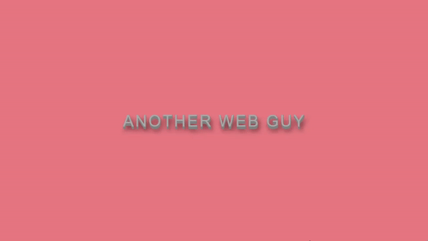

# Awesome-Text-Effects (React)


`awesome-text-effects` is a compilation of performant, extendable, highly customisable, production ready React Component of different text effects annd text hover effect for __react__ developers to use.

## Installation
`npm i awesome-text-effects`

## Usage
Awesome-text-effects comes with two primary components. First one is for Text Effect and second one is for Text Hover effect. 

```html
import { TextHover, TextEffect } from 'awesome-text-effects'
<TextHover text={[
              "This is a new text",
              "This is a second element"
            ]}
            type="1"
            name="PopOut" />
```

### `awesome-text-effects` props
| Attribute | Type           | Description                                                                                                                                |
|-----------|----------------|--------------------------------------------------------------------------------------------------------------------------------------------|
| text      | `list::string` | A list of string that is going to be displayed. Each element in the list represents one line that is going to be displayed on the screen.  |
| name      | `string`       | The string name of the effect you want to use. For more information regarding effect, please look below at the _demo examples_             |
| type      | `integer`      | This option is used for only certain effects. Default value is 1                                                                           |
| href      | `string`       | This option is for hover effect. Default value is null.                                                                                    |

## Demo example

Following are the `TextHover` name options:

- name: `HalfBar`
   </img>
  
---


- name: `strikethrough`
  </img>
  Original Author: Mandy Michael

---

- name: `HalfbarFull` 
   </img>
  You can change the text bar effect by typingn a number 1-5 in `type` prop.
  Author:tas Melnikov

----

- name: `SkewText`
   </img>
  Author: Adam Dipinto

---

- name: `PopOut`
   </img>
  Author: Ashish Anand

---

- name: `SkewOneline`
  </img>
  Author: delpher

---
---


Following are the `TextEffect` name options:

- name: `Neon`
   </img>
  Author: Sarah Fossheim

---

- name: `LayerThreeD` 
   </img>
  Author: creatz

---

- name: `Bubbly`
   </img>
  Author: Leena Lavanya

<!-- - name: `BoldThreeD`
   </img> -->
